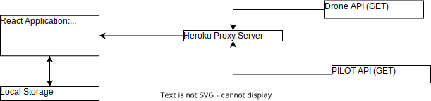
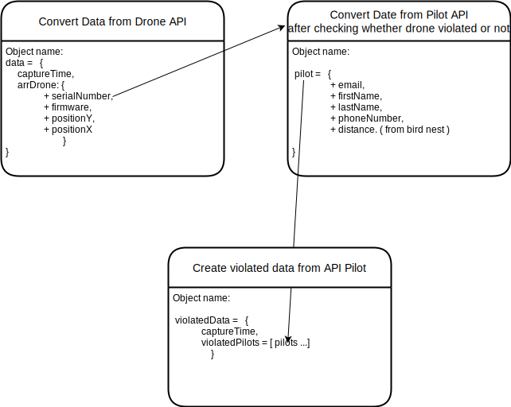
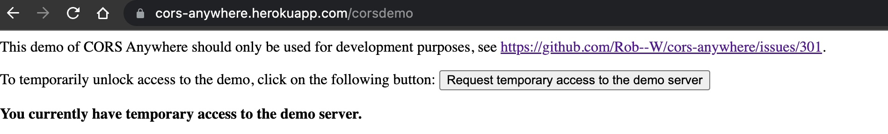
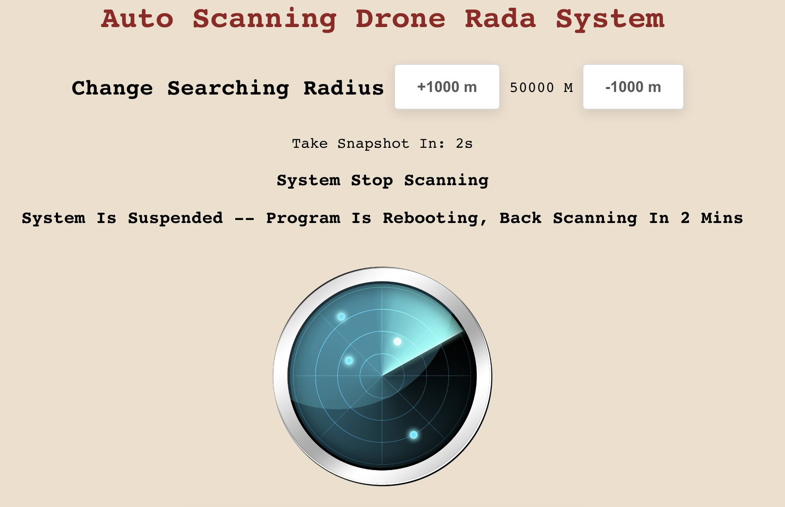
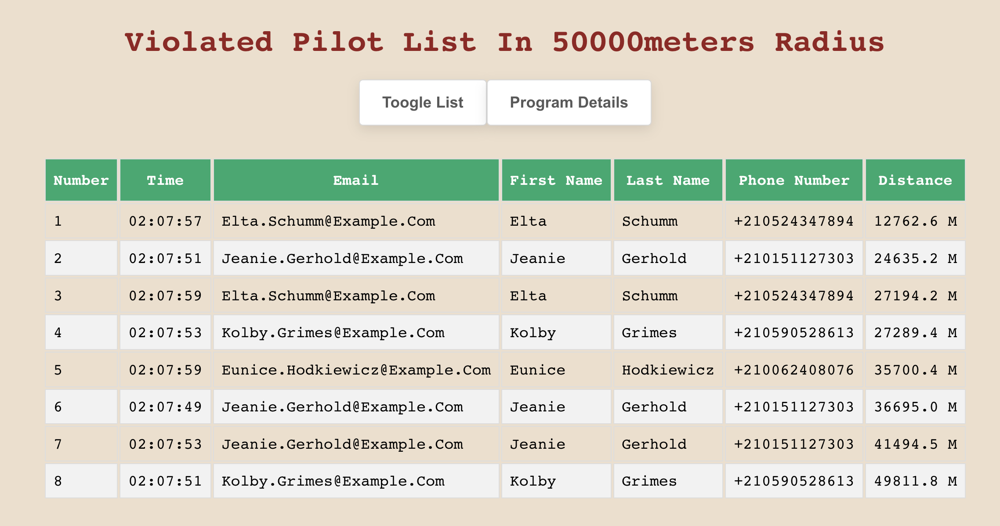

# Project Name: bird_nest_drone_protection

## Technology

REACT

## Running:

```
npm start
```

## Visit Live Page:

1. Before visit, please request temporary access to the Heroku Proxy Server by going to the below URL:

https://cors-anywhere.herokuapp.com/corsdemo

2. More details about CORS policy blocking system and fixing solution can be found at:

https://softauthor.com/how-to-fix-cors-issue-permanently-right-now/

3. After temporary access to Herokyu Proxy Server, Application can work at:

https://bird-nest.pages.dev/

TIP: For testing purpose, we can increase searching radius to at least > 50,000m to get more result. 

## Project Information:

A rare and endangered Monadikuikka has been spotted nesting at a local lake.

Unfortunately some enthusiasts have been a little too curious about this elusive bird species, flying their drones very close to the nest for rare photos and bothering the birds in the process.

To preserve the nesting peace, authorities have declared the area within 100 meters of the nest a no drone zone (NDZ), but suspect some pilots may still be violating this rule.

The authorities have set up drone monitoring equipment to capture the identifying information broadcasted by the drones in the area, and have given you access to a national drone pilot registry. They now need your help in tracking violations and getting in touch with the offenders.

## Data:

1. Drone position API:

```
GET assignments.reaktor.com/birdnest/drones
```

API return in XML format include postion and serial number each drone in area.

Return format example:

```
<?xml version="1.0" encoding="UTF-8"?>
<report>
    <deviceInformation deviceId="GUARDB1RD">
        <listenRange>500000</listenRange>
        <deviceStarted>2023-01-06T15:15:33.955Z</deviceStarted>
        <uptimeSeconds>1155</uptimeSeconds>
        <updateIntervalMs>2000</updateIntervalMs>
    </deviceInformation>
    <capture snapshotTimestamp="2023-01-06T15:34:48.924Z">
        <drone>
            <serialNumber>SN-0ZbHiOM0eZ</serialNumber>
            <model>Eagle</model>
            <manufacturer>MegaBuzzer Corp</manufacturer>
            <mac>3e:75:9e:d9:64:e0</mac>
            <ipv4>218.8.92.41</ipv4>
            <ipv6>4a2f:5b51:6aa6:e0ed:569c:4a8c:5a80:c85a</ipv6>
            <firmware>3.0.8</firmware>
            <positionY>22053.322858895954</positionY>
            <positionX>175967.00153897368</positionX>
            <altitude>4842.748104561821</altitude>
        </drone>
        <drone>
            <serialNumber>SN-Jjuzc0F-k7</serialNumber>
            <model>Altitude X</model>
            <manufacturer>DroneGoat Inc</manufacturer>
            <mac>65:01:e4:66:63:89</mac>
            <ipv4>111.2.102.218</ipv4>
            <ipv6>fbc4:26fa:6660:2272:4236:d361:aed7:3fbe</ipv6>
            <firmware>7.4.4</firmware>
            <positionY>356141.5291682769</positionY>
            <positionX>362471.9041822913</positionX>
            <altitude>4441.758357884101</altitude>
        </drone>
    </capture>
</report>
```

## Pilot Information:

1. Pilot information API:

```
GET assignments.reaktor.com/birdnest/pilots/serialNumber
```

searialNumber is registerd for each drone, Return data include user's name, contact information and other details for a drone's registerd owner in JSON format.

Example:

```
{
    "pilotId": "P-9gSkZ0lMVS",
    "firstName": "Amos",
    "lastName": "Walter",
    "phoneNumber": "+210823233616",
    "createdDt": "2022-08-18T10:29:42.887Z",
    "email": "amos.walter@example.com"
}
```

## User Stories:

1. Program when in operation, in every 2 second, capture all throne and stored violated drones (inside 100m radius from Bird_Nest and closest distance to the birdnest) which content drone's owner's information.
2. Validated List show information from the last 10min to anyone opening the application
3. Not require the user to manually refresh the view to see up-to-date information

## API Diagram from calling to project's storage:



## Data structure: 



## Page Display vs Function:

1. Request Temporarily valid for 1 day access: 



2. Open application, auto run, application searching radius can add or remove:



3. Violated List will shown, Program instruction can be found:




